# HAL-9001

One day, while configuring my Arch Linux system (I use Arch, by the way), I found myself furiously installing and juggling fourteen entirely separate little utilities just to perform remarkably mundane tasks: mounting and formatting a USB stick, managing Wi-Fi, pairing a Bluetooth headset, and tweaking audio. So I decided to build a single, unified control hub to handle all of it from one clean dashboard. Naturally, it had to be a TUI—because when you use Arch Linux (BTW), GUI utilities feel like an unnecessary compromise.

**Note:** No, there is absolutely **NO AI** inside this software. None whatsoever. Just fast, deterministic, pure Rust and direct D-Bus wizardry doing exactly what you tell them to do.


## Overview

Inspired by classic sci-fi aesthetics and engineered for maximum efficiency, **HAL-9001** goes far beyond passive monitoring. Built with **100% Pure Rust** and direct asynchronous **System D-Bus (`zbus`)** integration, it requires **zero external C libraries** and zero CLI wrappers for core subsystems.

---

## Screenshots

| Overview & Telemetry (Tab 1) | Detailed Overview & Top Processes (Tab 1 `[.]`) |
|:---:|:---:|
|  | 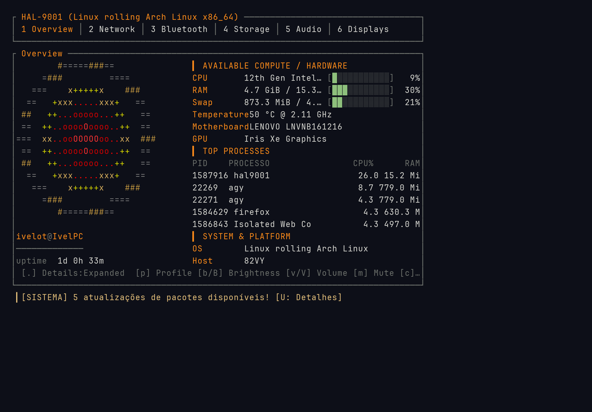 |

| Network & Wi-Fi Access Points (Tab 2) | Bluetooth & Peripheral Devices (Tab 3) |
|:---:|:---:|
| 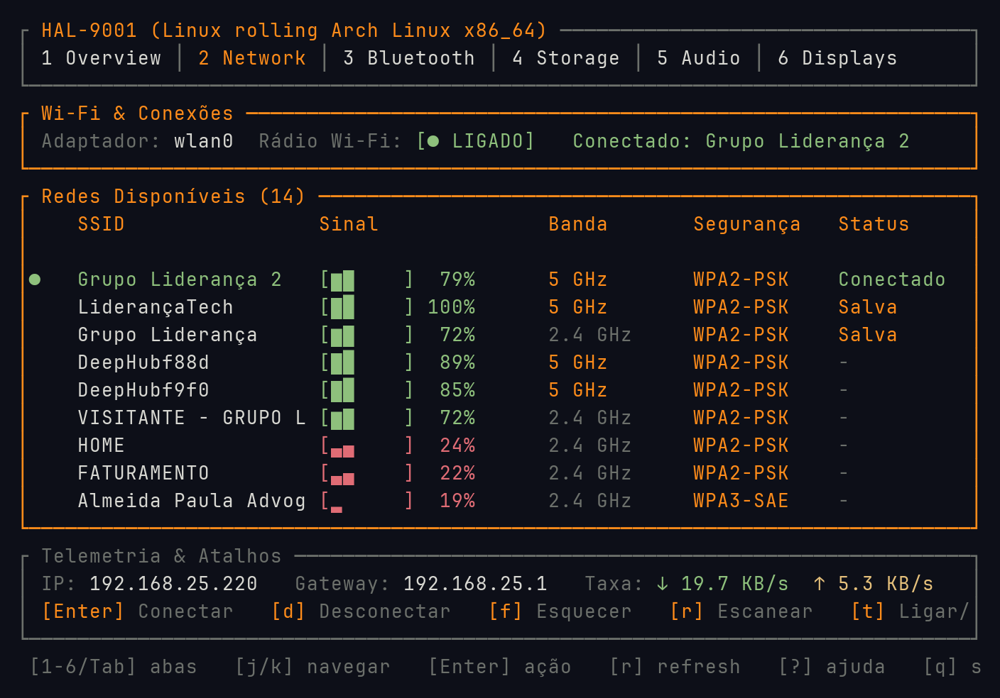 | 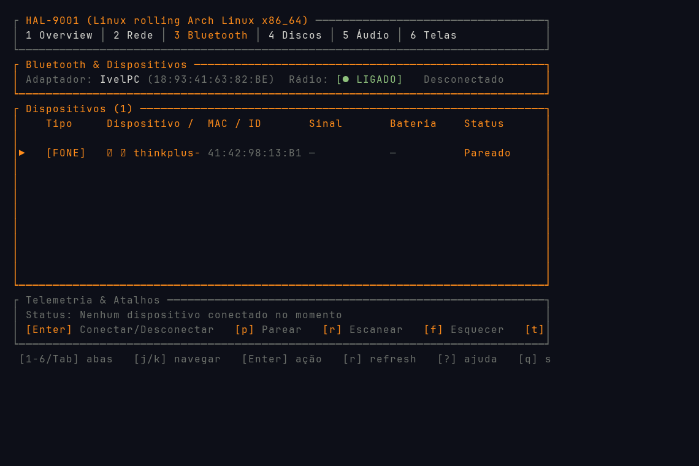 |

| Storage, Drives & Partitions (Tab 4) | Native Disk Space Analyzer (Tab 4 `[a]`) |
|:---:|:---:|
| 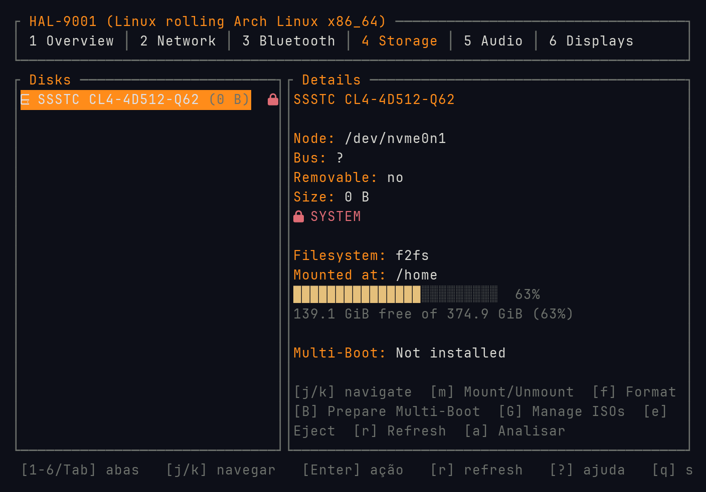 | 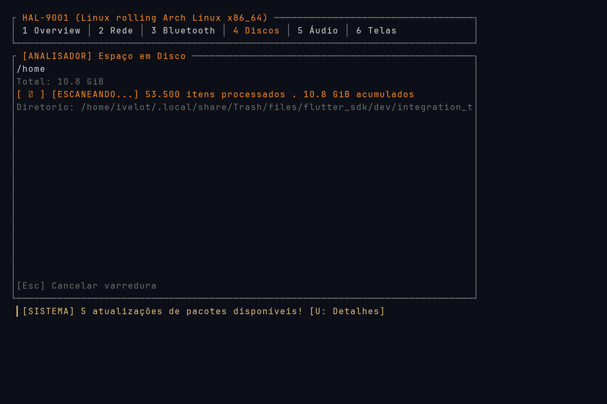 |

| PipeWire & PulseAudio Mixer (Tab 5) | Displays & Virtual Canvas Auto-Expand (Tab 6) |
|:---:|:---:|
| 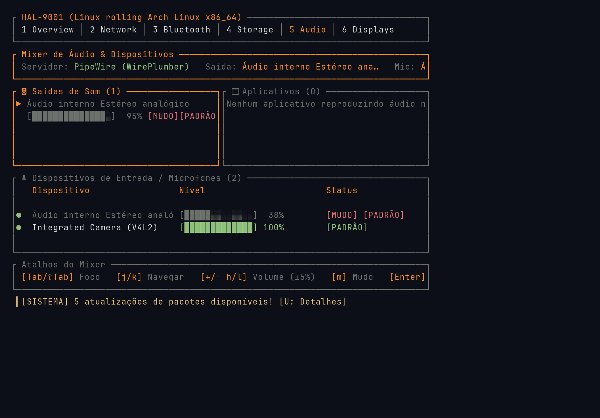 | 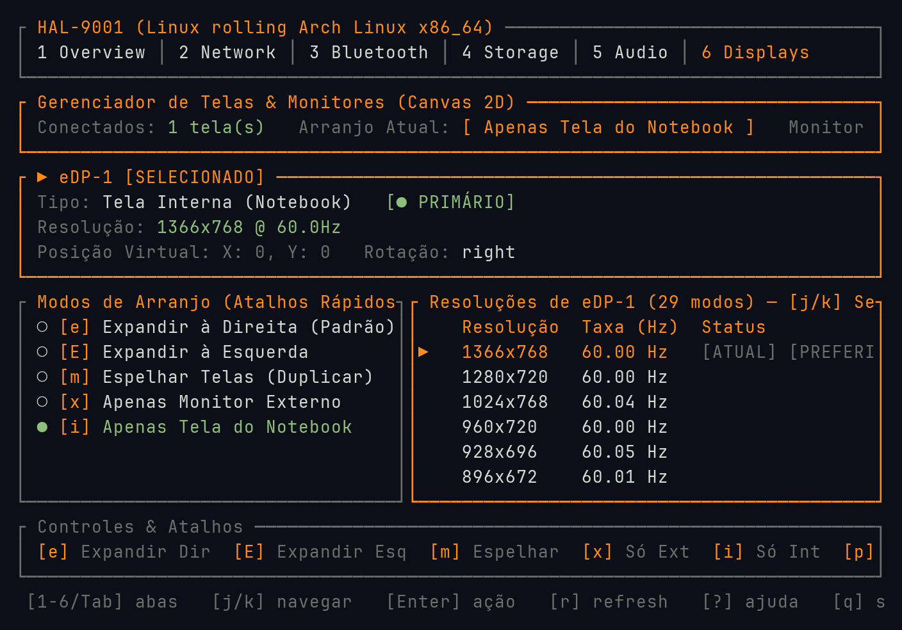 |

---

## Built-in Themes & Color Palettes

HAL-9001 includes 8 built-in themes out of the box, switchable in real-time via the settings modal (`[c]` / `[F2]`) or in `config.toml`:

| HAL Classic (Default) | Catppuccin Mocha |
|:---:|:---:|
| 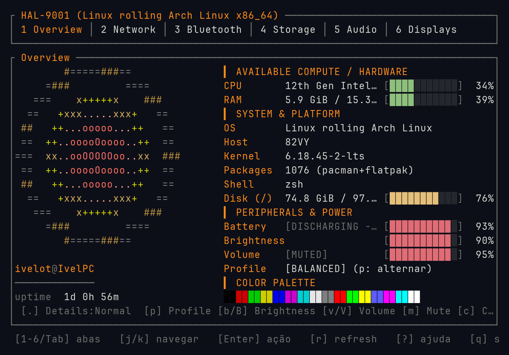 | 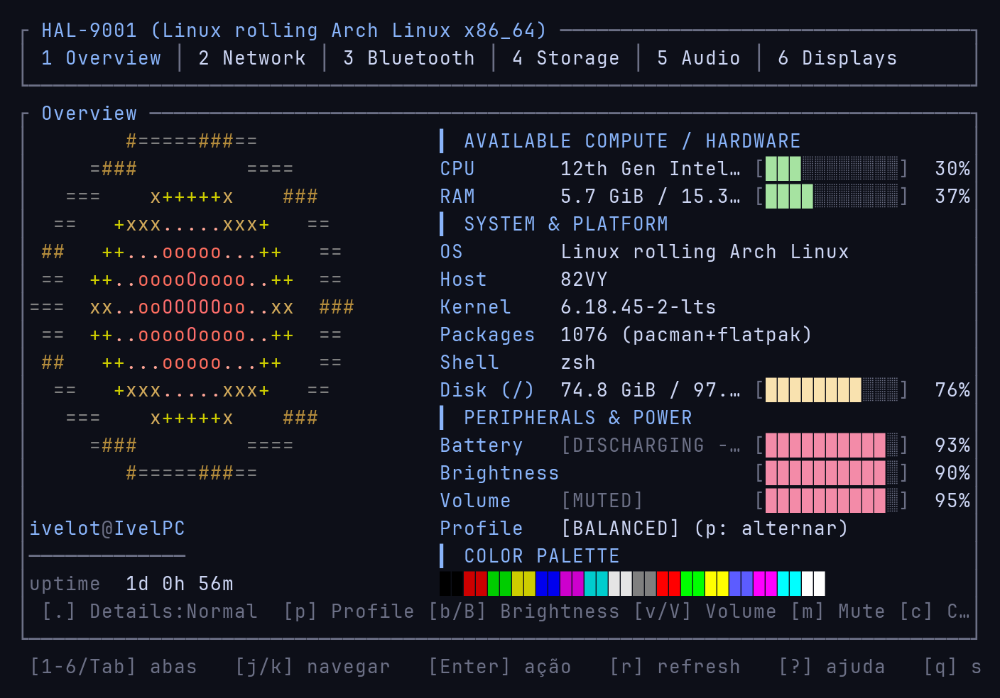 |

| Dracula | Gruvbox Dark |
|:---:|:---:|
| 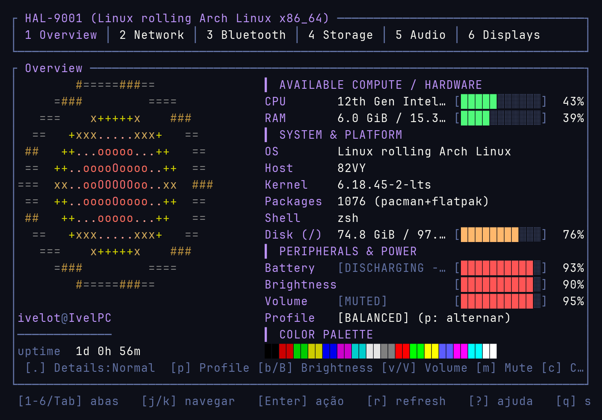 | 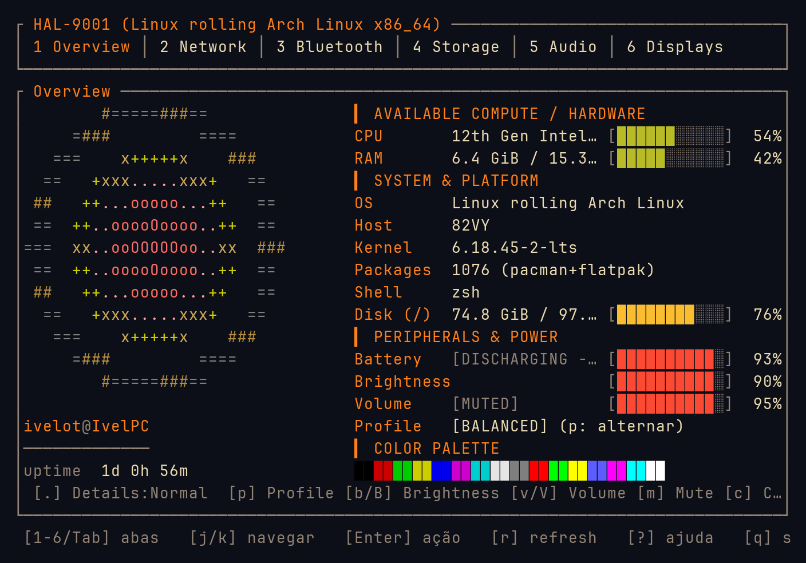 |

| Nord Arctic | Tokyo Night |
|:---:|:---:|
| 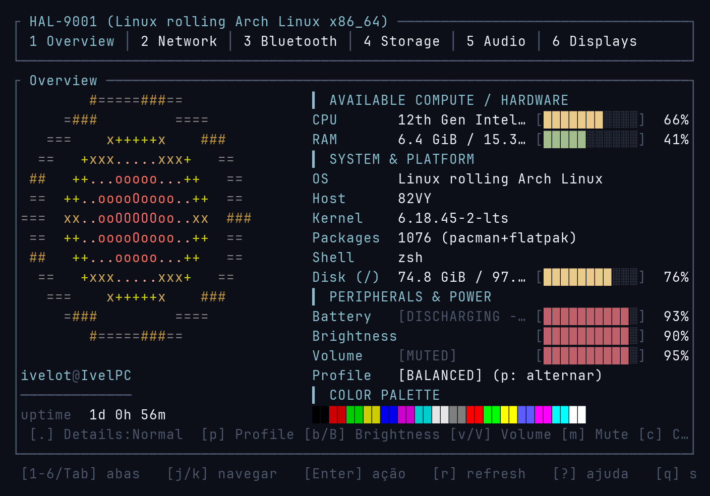 | 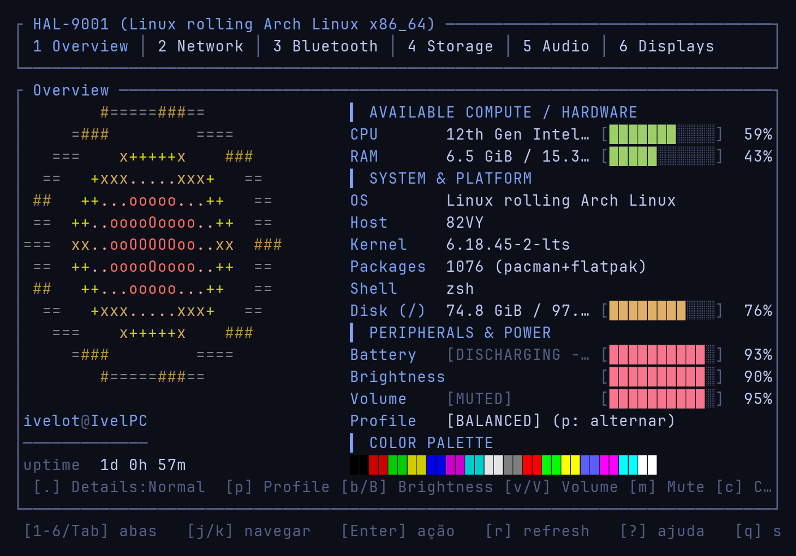 |

| Cyberpunk 2077 | Minimal Monochrome |
|:---:|:---:|
| 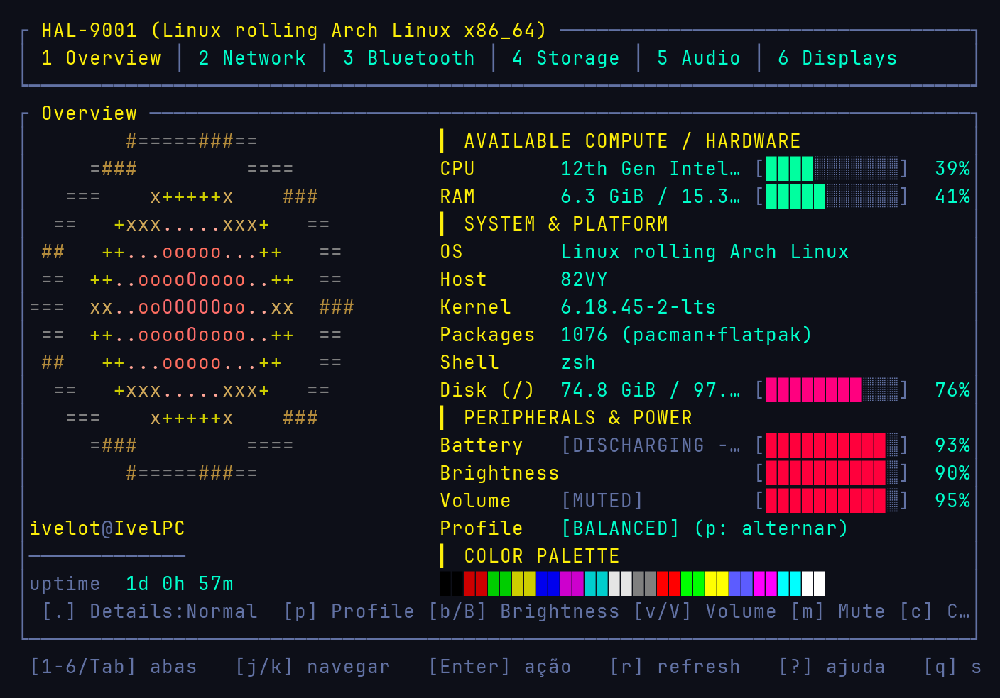 | 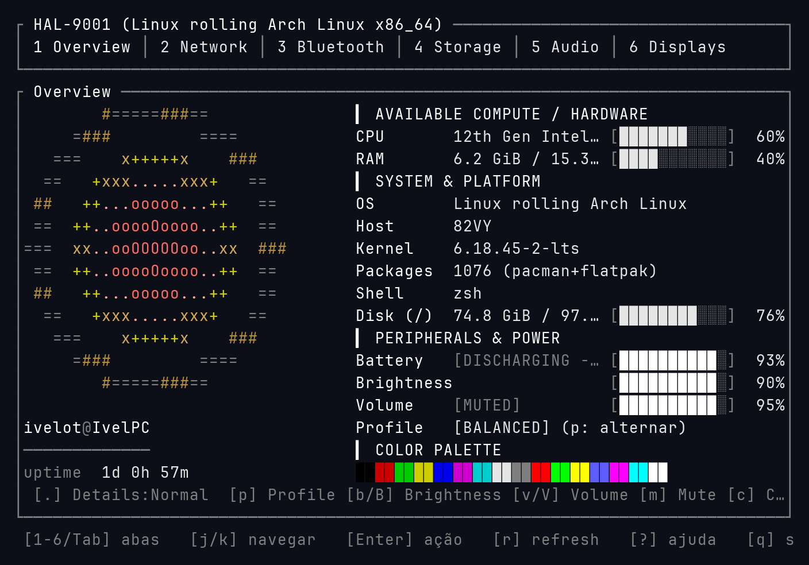 |

---

## Features & Architecture

### 1. System Overview & Telemetry (Tab 1)
- Real-time CPU, RAM, Swap, Disk I/O, Network throughput, and Top 5 Process metrics.
- Hardware sensor monitoring (CPU temperatures, thermal throttles, fan speeds).
- Backlight and audio volume controls with native keybindings (`[b]/[B]`, `[v]/[V]`, `[m]`).
- Keyboard illumination control (`[j]/[k]` in peripherals) and unified Airplane Mode radio killswitch (`[A]`).
- Power profile switcher (`[p]/[P]` cycling *Power-Saver*, *Balanced*, *Performance*).

### 2. Wi-Fi & Network (Tab 2 — Pure Rust)
- **100% Pure Rust D-Bus:** Direct asynchronous communication with `org.freedesktop.NetworkManager` via `zbus`.
- **Zero CLI Wrappers:** No reliance on `nmcli`, `iw`, or C-FFI.
- Access Point discovery with signal strength bars, frequency bands (2.4GHz, 5GHz, 6GHz Wi-Fi 6E/7), and security badges (WPA2, WPA3 SAE, OWE).
- Masked password input modal for encrypted networks.
- Real-time network interface telemetry (RX/TX throughput and total transfer).

### 3. Bluetooth & Peripheral Hub (Tab 3 — Pure Rust)
- **100% Pure Rust D-Bus:** Direct asynchronous communication with `org.bluez` (`Adapter1`, `Device1`, `Battery1`, `ObjectManager`).
- **Zero C Dependencies:** No `libbluetooth`, `glib`, `bluez-libs`, or `bluetoothctl` calls.
- Device discovery (BLE & Classic) with 30-second battery-saving auto-timeout.
- Smart categorization: Audio/Headsets, Gamepads/Controllers, Keyboards, Mice, Phones, PCs.
- Live battery level telemetry (`org.bluez.Battery1`) for TWS earbuds and headsets.
- One-key actions: Connect/Disconnect (`[Enter]`), Pair (`[p]`), Scan (`[r]`), Forget (`[f]`), Radio On/Off (`[t]`), Block/Unblock (`[b]`).

### 4. Storage, Partitioning, ISO Flasher & Disk Analyzer (Tab 4)
- Simplified, drive-centric view with hierarchical partition tree (`org.freedesktop.UDisks2`).
- **Native Disk Space Analyzer (`[a]`):** Pure Rust recursive directory size scanner with live streaming progress, animated spinner, and drill-down navigation (`[Enter]` dive in, `[Backspace]` go up).
- **5-Layer Safety Lock:** Hard protection preventing accidental format, eject, or flash operations on system/root disks.
- **Pure Rust FAT32 Formatting:** Embedded volume formatting using `fatfs` without requiring `dosfstools`/`mkfs.vfat`.
- **Bootable ISO Flasher:** Raw image flasher with SHA-256 integrity verification, speed/ETA calculator, and file picker.
- **Multi-Boot / Ventoy Manager:** Prepare USB drives and manage ISO collections in `/ISOs/` directly from the TUI.
- **Native Masked Sudo Elevation:** Secure in-TUI password modal (`*`) for privileged storage actions.

### 5. Audio Mixer & Hardware Hub (Tab 5 — Pure Rust)
- **PipeWire & PulseAudio Engine:** Native asynchronous integration with WirePlumber / PipeWire (`wpctl`) and PulseAudio fallback.
- **3 Specialized Sub-Panels:**
  - **`[1] Audio Outputs (Sinks)`**: Internal Speakers, Headphones (P2/Bluetooth A2DP), HDMI/DisplayPort audio.
  - **`[2] Applications (Streams)`**: Individual volume sliders and mute toggles per running app (**Spotify**, **Firefox/Chrome**, **Discord**, **Steam**, **VLC**, games).
  - **`[3] Microphones (Sources)`**: Input gain and mute control for internal mics, headsets, and USB microphones.
- **Volume Overdrive (0..=150%):** Visual color progression (accent -> green -> yellow/red overdrive).
- **One-Key Shortcuts:** Volume (`[+/-]` or `[h/l]`), Mute (`[m]`), Set Default Device (`[Enter]`), Switch Category (`[Tab]` or `[1/2/3]`).

### 6. Displays, Monitors & Auto-Expand Hub (Tab 6 — Wayland & X11)
- **Multi-Server Detection:** Dynamic support for Wayland (`wlr-randr`, `hyprctl`) and X11 (`xrandr`).
- **Automatic Hotplug Auto-Expand:** Instantly detects when an external monitor (HDMI/DisplayPort/USB-C) is connected and automatically activates **Extend-Right Mode** with instant TUI toast notifications.
- **Interactive 2D Canvas Diagram:** Spatial ASCII representation of connected screens with real-time resolution, position, primary badge, and refresh rates.
- **Display Modes:**
  - `[1] Extend Right (Default)`
  - `[2] Extend Left`
  - `[3] Mirror Screens`
  - `[4] External Monitor Only`
  - `[5] Notebook Screen Only`
- **Output Management:** Set Primary Display (`[p]`), change resolutions/Hz, and toggle displays.
- **Unified Hardware Toast System:** Statusline notifications for Monitor connect/disconnect, USB insertions/ejections, Bluetooth pairing, and network transitions.

---

## Global Keybindings

| Key | Action |
|---|---|
| `1` .. `6` / `Tab` / `Shift-Tab` | Switch active tab |
| `j` / `k` or `Down` / `Up` | Navigate device/item lists |
| `Enter` | Primary action (Connect, Mount/Unmount, Confirm, Drill down) |
| `r` | Refresh snapshot / Trigger active rescan |
| `.` | Toggle normal vs. expanded overview telemetry |
| `c` / `F2` | Open interactive settings & theme configuration |
| `b` / `B` | Decrease / Increase screen brightness |
| `v` / `V` | Decrease / Increase audio volume (`m` for mute) |
| `p` / `P` | Cycle system power profiles |
| `?` | Toggle in-app help modal |
| `q` / `Ctrl-C` | Exit HAL-9001 |

---

## Installation & Distribution Channels

Choose your preferred method to install **HAL-9001**:

### 1. Universal One-Line Installer (Recommended for any Linux)

Works out of the box on any Linux distribution (detects architecture, installs static binary and desktop shortcut):
```bash
curl -fsSL https://raw.githubusercontent.com/IvelOt/hal-9001/main/install.sh | bash
```

### 2. Arch Linux (AUR)

Available on the **Arch User Repository** as both a precompiled binary (`hal-9001-bin`) and source build (`hal-9001`):
```bash
# Instant precompiled binary (recommended):
yay -S hal-9001-bin
# or
paru -S hal-9001-bin

# Build from source:
yay -S hal-9001
```

### 3. Cargo (Crates.io)

Universal Rust installation via [crates.io/crates/hal-9001](https://crates.io/crates/hal-9001):
```bash
cargo install --locked hal-9001
```

### 4. NixOS & Nix Flakes

Run directly via Nix Flakes without prior installation:
```bash
nix run github:IvelOt/hal-9001
```
Or add to your NixOS `configuration.nix` / Home Manager:
```nix
inputs.hal-9001.url = "github:IvelOt/hal-9001";
```

### 5. Debian / Ubuntu (.deb)

Download the official Debian package from [GitHub Releases](https://github.com/IvelOt/hal-9001/releases/latest):
```bash
curl -sSL -O https://github.com/IvelOt/hal-9001/releases/download/v0.1.2/hal-9001_0.1.2_amd64.deb
sudo apt install ./hal-9001_0.1.2_amd64.deb
```

### 6. Build from Source Manually

Ensure you have Rust stable (1.80+) installed:
```bash
git clone https://github.com/IvelOt/hal-9001.git
cd hal-9001
cargo test
cargo build --release
./target/release/hal9001
```

---

## 📦 Matriz de Distribuição e Empacotamento Oficial

| Canal / Formato | Plataforma Alvo | Comando de Instalação | Status |
| :--- | :--- | :--- | :--- |
| **Arch User Repository (AUR - Fonte)** | Arch Linux, Manjaro, EndeavourOS | `paru -S hal-9001` ou `yay -S hal-9001` | ✅ **Live** |
| **Arch User Repository (AUR - Binário)** | Arch Linux (x86_64, aarch64) | `paru -S hal-9001-bin` ou `yay -S hal-9001-bin` | ✅ **Live** |
| **Crates.io (Rust Cargo)** | Linux Geral (qualquer distro com Rust) | `cargo install hal-9001` | ✅ **Live** |
| **Debian / Ubuntu (.deb)** | Debian 11/12+, Ubuntu 20.04+, Mint | `sudo apt install ./hal-9001_0.1.3_amd64.deb` | ✅ **Live** |
| **GitHub Releases** | Static Musl & Gnu Tarballs | [Releases](https://github.com/IvelOt/hal-9001/releases/latest) | ✅ **Live** |

---

## Configuration & Themes

HAL-9001 searches for configuration in order:
1. `$HAL9001_CONFIG`
2. `~/.config/hal-9001/config.toml`
3. `./config.toml`

Customizable options include UI refresh rates (15/30/60 FPS), language (`auto`, `pt-BR`, `en-US`, `es-ES`), Nerd Font icon toggles, ASCII logo styles, polling intervals, and color palettes (*HAL Classic*, *Monochrome*, *Catppuccin*, *Dracula*, *Gruvbox*, *Nord*, *Tokyo Night*, *Cyberpunk*).
