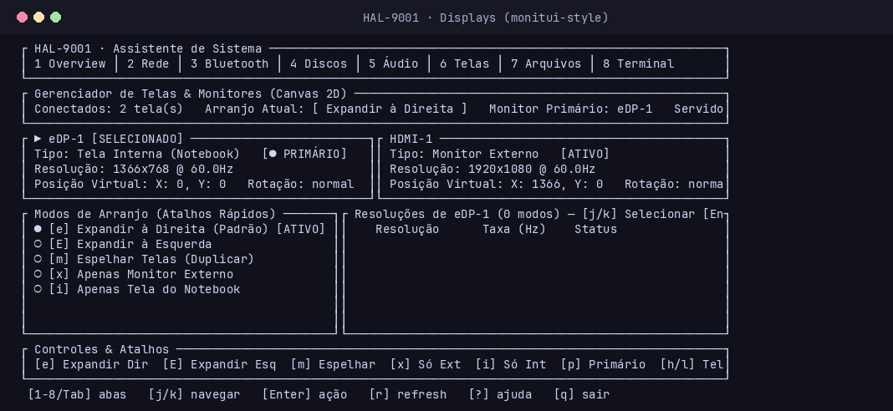

# HALL-9001

**HALL-9001** is an advanced, high-performance Rust terminal system monitor and hardware control hub featuring a modern, btop-inspired TUI. It provides comprehensive system telemetry alongside active hardware, network, bluetooth, and storage management from a single responsive dashboard.


## Overview

Inspired by classic sci-fi aesthetics and engineered for maximum efficiency, HALL-9001 goes far beyond passive monitoring. Built with **100% Pure Rust** and direct asynchronous **System D-Bus (`zbus`)** integration, it requires **zero external C libraries** and zero CLI wrappers for core subsystems.

---

## Screenshots

| Overview & Telemetry (Tab 1) | Network & Wi-Fi (Tab 2) |
|:---:|:---:|
|  |  |

| Bluetooth & Devices (Tab 3) | Storage & Disk Space Analyzer (Tab 4) |
|:---:|:---:|
|  |  |

| Audio Mixer & Per-App Streams (Tab 5) | Displays & Monitors / Auto-Expand (Tab 6) |
|:---:|:---:|
|  |  |

---

## Features & Architecture

### 1. System Overview & Telemetry (Tab 1)
- Real-time CPU, RAM, Swap, Disk I/O, Network throughput, and Top 5 Process metrics.
- Hardware sensor monitoring (CPU temperatures, thermal throttles, fan speeds).
- Backlight and audio volume controls with native keybindings (`[b]/[B]`, `[v]/[V]`, `[m]`).
- Keyboard illumination control (`[j]/[k]` in peripherals) and unified Airplane Mode radio killswitch (`[A]`).
- Power profile switcher (`[p]/[P]` cycling *Power-Saver*, *Balanced*, *Performance*).

### 2. Wi-Fi & Network (Tab 2 — Pure Rust)
- **100% Pure Rust D-Bus:** Direct asynchronous communication with `org.freedesktop.NetworkManager` via `zbus`.
- **Zero CLI Wrappers:** No reliance on `nmcli`, `iw`, or C-FFI.
- Access Point discovery with signal strength bars, frequency bands (2.4GHz, 5GHz, 6GHz Wi-Fi 6E/7), and security badges (WPA2, WPA3 SAE, OWE).
- Masked password input modal for encrypted networks.
- Real-time network interface telemetry (RX/TX throughput and total transfer).

### 3. Bluetooth & Peripheral Hub (Tab 3 — Pure Rust)
- **100% Pure Rust D-Bus:** Direct asynchronous communication with `org.bluez` (`Adapter1`, `Device1`, `Battery1`, `ObjectManager`).
- **Zero C Dependencies:** No `libbluetooth`, `glib`, `bluez-libs`, or `bluetoothctl` calls.
- Device discovery (BLE & Classic) with 30-second battery-saving auto-timeout.
- Smart categorization: Audio/Headsets, Gamepads/Controllers, Keyboards, Mice, Phones, PCs.
- Live battery level telemetry (`org.bluez.Battery1`) for TWS earbuds and headsets.
- One-key actions: Connect/Disconnect (`[Enter]`), Pair (`[p]`), Scan (`[r]`), Forget (`[f]`), Radio On/Off (`[t]`), Block/Unblock (`[b]`).

### 4. Storage, Partitioning, ISO Flasher & Disk Analyzer (Tab 4)
- Simplified, drive-centric view with hierarchical partition tree (`org.freedesktop.UDisks2`).
- **Native Disk Space Analyzer (`[a]`):** Pure Rust recursive directory size scanner with live streaming progress, animated spinner, and drill-down navigation (`[Enter]` dive in, `[Backspace]` go up).
- **5-Layer Safety Lock:** Hard protection preventing accidental format, eject, or flash operations on system/root disks.
- **Pure Rust FAT32 Formatting:** Embedded volume formatting using `fatfs` without requiring `dosfstools`/`mkfs.vfat`.
- **Bootable ISO Flasher:** Raw image flasher with SHA-256 integrity verification, speed/ETA calculator, and file picker.
- **Multi-Boot / Ventoy Manager:** Prepare USB drives and manage ISO collections in `/ISOs/` directly from the TUI.
- **Native Masked Sudo Elevation:** Secure in-TUI password modal (`*`) for privileged storage actions.

### 5. Audio Mixer & Hardware Hub (Tab 5 — Pure Rust)
- **PipeWire & PulseAudio Engine:** Native asynchronous integration with WirePlumber / PipeWire (`wpctl`) and PulseAudio fallback.
- **3 Specialized Sub-Panels:**
  - **`[1] Saidas de Som (Sinks)`**: Internal Speakers, Headphones (P2/Bluetooth A2DP), HDMI/DisplayPort audio.
  - **`[2] Aplicativos (Streams)`**: Individual volume sliders and mute toggles per running app (**Spotify**, **Firefox/Chrome**, **Discord**, **Steam**, **VLC**, games).
  - **`[3] Microfones (Sources)`**: Input gain and mute control for internal mics, headsets, and USB microphones.
- **Volume Overdrive (0..=150%):** Visual color progression (accent -> green -> yellow/red overdrive).
- **One-Key Shortcuts:** Volume (`[+/-]` or `[h/l]`), Mute (`[m]`), Set Default Device (`[Enter]`), Switch Category (`[Tab]` or `[1/2/3]`).

### 6. Displays, Monitors & Auto-Expand Hub (Tab 6 — Wayland & X11)
- **Multi-Server Detection:** Dynamic support for Wayland (`wlr-randr`, `hyprctl`) and X11 (`xrandr`).
- **Automatic Hotplug Auto-Expand:** Instantly detects when an external monitor (HDMI/DisplayPort/USB-C) is connected and automatically activates **Extend-Right Mode** with instant TUI toast notifications.
- **Interactive 2D Canvas Diagram:** Spatial ASCII representation of connected screens with real-time resolution, position, primary badge, and refresh rates.
- **Display Modes:**
  - `[1] Expandir a Direita (Extend Right)`
  - `[2] Expandir a Esquerda (Extend Left)`
  - `[3] Espelhar Telas (Mirror)`
  - `[4] Apenas Monitor Externo`
  - `[5] Apenas Tela do Notebook`
- **Output Management:** Set Primary Display (`[p]`), change resolutions/Hz, and toggle displays.
- **Unified Hardware Toast System:** Statusline notifications for Monitor connect/disconnect, USB insertions/ejections, Bluetooth pairing, and network transitions.

---

## Supported Operating Systems & Environments

HAL-9001 runs natively on Linux across modern desktop environments and window managers:

| Distribution / Platform | Packaging / Installation | Status |
|:---|:---|:---|
| **Arch Linux / Manjaro / EndeavourOS** | AUR: `hall-9001` or `hall-9001-bin` (`paru -S hall-9001`) | Supported |
| **Debian / Ubuntu / Pop!_OS / Mint** | Native `.deb` package (`dpkg -i hall-9001_amd64.deb`) | Supported |
| **NixOS / Linux with Nix** | Flake: `nix run github:IvelOt/hall-9001` | Supported |
| **Fedora / RHEL / Rocky Linux** | RPM package / Copr (`dnf install hall-9001`) | Supported |
| **Alpine Linux / Void Linux** | Static binary (`x86_64-unknown-linux-musl`) | Supported |
| **Cargo / Crates.io (Universal)** | `cargo install --locked hall-9001` | Supported |

---

## Global Keybindings

| Key | Action |
|---|---|
| `1` .. `6` / `Tab` / `Shift-Tab` | Switch active tab |
| `j` / `k` or `Down` / `Up` | Navigate device/item lists |
| `Enter` | Primary action (Connect, Mount/Unmount, Confirm, Drill down) |
| `r` | Refresh snapshot / Trigger active rescan |
| `.` | Toggle normal vs. expanded overview telemetry |
| `c` / `F2` | Open interactive settings & theme configuration |
| `b` / `B` | Decrease / Increase screen brightness |
| `v` / `V` | Decrease / Increase audio volume (`m` for mute) |
| `p` / `P` | Cycle system power profiles |
| `?` | Toggle in-app help modal |
| `q` / `Ctrl-C` | Exit HALL-9001 |

---

## Installation & Build

Ensure you have Rust (stable) installed. System daemons (`dbus`, `systemd`, `NetworkManager`, `bluez`, `udisks2`) are queried directly via D-Bus.

```bash
# Clone the repository
git clone https://github.com/IvelOt/hall-9001.git
cd hall-9001

# Run full test suite (100+ unit and integration tests)
cargo test

# Build release binary
cargo build --release

# Run HALL-9001
./target/release/hal9001
```

---

## Configuration & Themes

HALL-9001 searches for configuration in order:
1. `$HAL9001_CONFIG`
2. `~/.config/hall-9001/config.toml`
3. `./config.toml`

Customizable options include UI refresh rates (15/30/60 FPS), language (`auto`, `pt-BR`, `en-US`, `es-ES`), Nerd Font icon toggles, ASCII logo styles, polling intervals, and color palettes (*HAL Classic*, *Monochrome*, *Catppuccin*).
