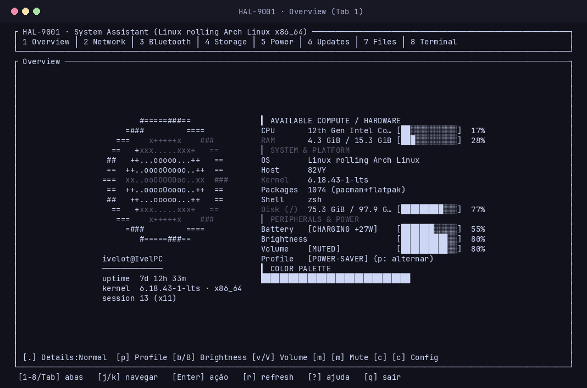
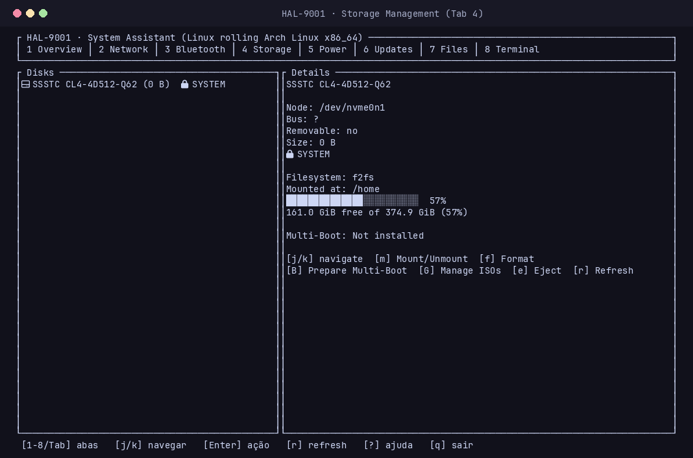
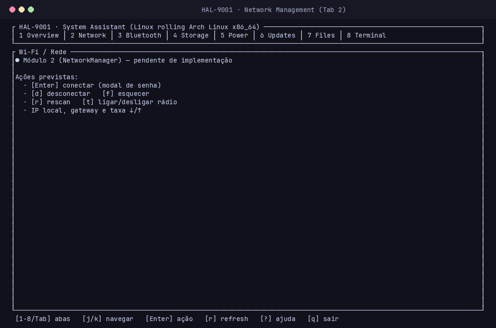

# HALL-9001

**HALL-9001** is a Rust-based terminal system monitor & control hub featuring a modern, btop-inspired TUI. It is designed to provide comprehensive system oversight alongside active hardware and storage management from a single, responsive dashboard.



## 🌟 Overview

Inspired by classic sci-fi interfaces and built for efficiency, HALL-9001 goes beyond passive monitoring. It integrates deep system controls, native security features, and seamless tile window manager support (like i3wm) directly into your terminal.

## 📸 Screenshots

| Overview & Telemetry (Tab 1) | Storage & Drive Management (Tab 4) |
|---|---|
|  |  |

| Network & Connections (Tab 2) |
|---|
|  |

## ✨ Features

- **System Monitoring:** 
  - Real-time tracking of CPU, RAM, Swap, Disks, Networks, and Processes.
- **Hardware Controls:**
  - Battery status and power management.
  - Backlight control (via `brightnessctl`).
  - Bluetooth management (via `bluetoothctl`/`bluez`).
  - WiFi and network selection (via `nmcli`/`NetworkManager`).
  - Audio and volume controls.
- **Storage Management:**
  - Complete drive and partition listing (Windows-style drive list).
  - FAT32 partition formatting using pure Rust (`fatfs`) with elevation.
  - Disk mounting and unmounting (integrated with `udisks2`).
  - Multi-boot / Ventoy integration.
- **Security & Elevation:**
  - Native masked sudo password prompt modal for safe, privileged storage operations directly within the TUI.
- **Tiling WM Support:**
  - i3wm integration and customizable keybindings.

## 🚀 Installation & Build

Ensure you have Rust and Cargo installed, as well as the necessary system dependencies (e.g., `brightnessctl`, `bluetoothctl`, `nmcli`, `udisks2`).

```bash
# Clone the repository
git clone https://github.com/IvelOt/hall-9001.git
cd hall-9001

# Build the release binary
cargo build --release

# The compiled binary will be located in target/release/
./target/release/hal9001
```

## ⚙️ Configuration & Themes

HALL-9001 supports extensive configuration and theming options. By default, it looks for a `config.toml` file in your standard config directory.

Themes can be adjusted to match your system aesthetics or your favorite sci-fi color palette, with simple declarative rules for UI components, charts, and metrics.
